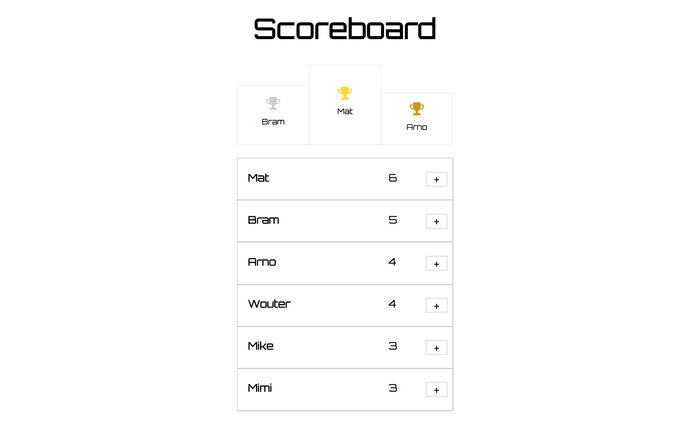

# Scoreboard

Simple React app modified during week 5 of the 9-week Codaisseur Academy.

The basic app was provided, the exercise was to add Redux to the app to get to know the state, actions and the benefits of Redux.



## Running Locally

Make sure you have [Node.js](https://nodejs.org/en/) and [Yarn](https://yarnpkg.com/lang/en/) installed.

```bash
git clone git@github.com:Abohte/scoreboard.git
cd scoreboard
yarn install
yarn start
```
